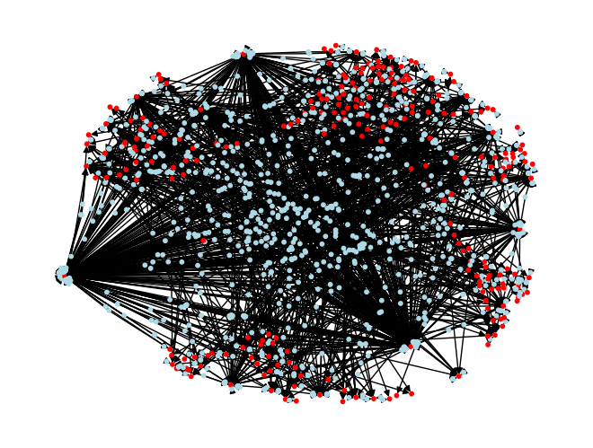
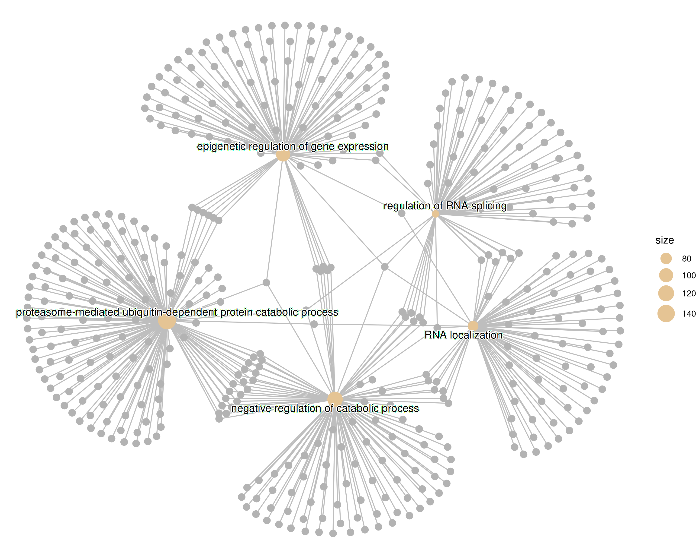

# Hidden-State-Genomics

## Introduction

Advances in Mechanistic Interpretability have made it possible to decompose neural network activations into interpretable features via sparse auto-encoders. These features represent concepts that are learned by the model, and can be used to understand how a neural network makes its predictions. Early mechanistic interpretability studies on protein language models have led to speculation that studying the internals of these models may reveal novel biology, however, investigating this theory poses a difficult technical challenge. We attempt to answer this question by constructing and exploring knowledge-graph relationships between features extracted from genomic language model embeddings and predicted RNA structures for novel cisplatin-RNA complexes. 

**Contents**
- [Architecture Overview](#architecture-overview)
- [Example Graph Analysis](#multi-edge-sae-knowledge-graphs)
- [Core Workflows](#core-workflows)
- [Setup/Installation](#setup-instructions)
- [Development Guide](#development-guide)

### Multi-Edge SAE Knowledge Graphs

*Multi-Layer Directed SAE knowledge graph on a random selection of cisplatin binding motifs. The basic knowledge graph is constructed from per-token strongest feature activations with associations drawn according to the triplet (subject, object, predicate) where (token, feature, sequenceID) includes metadata containing NCBI refseq annotations as found in the UCSC genome broswer. Red nodes indicate a feature, blue nodes indicate a token, and nodes are connected based on the presence of a token causing feature activation. Edge metadata is used for gene set enrichment analysis.*



## Architecture Overview

### Core Pipeline Components

**Data Flow**: `Genomic sequences → NT embeddings → SAE features → Knowledge graphs → Biological analysis`

- **`hsg/sae/`**: Sparse Auto-Encoder training and feature extraction
  - `train.py` - Main SAE training with CLI via `tapify()`
  - `dictionary.py` - AutoEncoder implementation for sparse feature learning
  - Supports expansion factors (ef8, ef16, ef32) to control dictionary size
- **`hsg/pipelines/`**: Data processing and model integration
  - `hidden_state.py` - Extract embeddings from nucleotide transformer models
  - `variantmap.py` - DNA variant processing using HGVS and SeqRepo
- **`hsg/featureanalysis/`**: Knowledge graph construction and analysis
  - `featureKG.py` - Main KG construction from SAE features
  - `intervention.py` - Feature intervention experiments
  - Shell scripts for batch processing large datasets

### Data Organization

- **`data/`**: Large datasets (not tracked in git)
  - Cisplatin binding data: `cisplatin_pos.fa`, `cisplatin_neg45k.fa`
  - Knowledge graphs: `*_kg.json` files
  - Reference annotations: `Annotation Data/` with GTF files
  - Gene sets and enrichment results: `gene_sets/`, `*_gene_sets/`
- **`checkpoints/`**: Trained SAE models organized by expansion factor
- **`notebook_stash/`**: Analysis notebooks for visualization and exploration

### External Dependencies

- **InstaDeepAI Nucleotide Transformer** (500M parameters)
- **SeqRepo**: Local genomic sequence database
- **MAFFT**: Multiple sequence alignment
- **Google Cloud Storage**: Large model/dataset storage 

### Gene Set Enrichment Analysis of SAE Features (Feature 3378)

*High-centrality feature-derived gene set enrichment for SAE feature 3378 (layer 23, ef8), derived from PageRank centrality score in a knowledge graph generated from putative cisplatin-binding transcripts in the human genome. In the enriched gene set graph for feature 3378, we can see enriched GO term DAG structure and general biological processes identifiable from DNA sequences alone using genomic language model features extracted via SAE.*



## Core Workflows

### SAE Training
Train sparse auto-encoders on nucleotide transformer embeddings:

```bash
python -m hsg.sae.train --model_name $NT_MODEL --layer_idx 23 --expansion_factor 8
```

Models are saved to `checkpoints/` with TensorBoard logging for training metrics.

### Knowledge Graph Construction
Generate knowledge graphs from SAE features and genomic sequences:

```bash
python -m hsg.featureanalysis.featureKG --input data/sequences.fa --output data/output_kg.json
```

### Feature Intervention Analysis
Test feature importance via controlled interventions:

```bash
python -m hsg.featureanalysis.intervention --feature 3378 --min_act 0.1 --act_factor 10.0
```

### Batch Processing
Large-scale analysis using shell scripts in `hsg/featureanalysis/`:

```bash
# Process multiple sequence files
./hsg/featureanalysis/largeKGconstruction.sh

# Run intervention battery across parameter grids
./hsg/featureanalysis/intervention_battery.sh
```

## Development Guide

### Command-Line Interface Pattern

All main scripts use `tap` (typed-argument-parser) for CLI with the pattern:

```python
from tap import tapify

def main_function(arg1: str, arg2: int = 8):
    """Function docstring becomes help text"""
    pass

if __name__ == "__main__":
    tapify(main_function)
```

Run modules as: `python -m hsg.module.script --arguments`

### Environment Variables

**Critical**: Always load environment variables first in scripts:

```python
from dotenv import load_dotenv
load_dotenv()
```

### Testing

Run the full test suite from project root:

```bash
python -m unittest  # Basic run
python -m unittest -v  # Verbose output
```

Key test categories:
- Environment variables (`test_env_vars.py`)
- Pipeline integration (`test_pipelines.py`) 
- SAE objects (`test_sae_objects.py`)

### Memory Management

The codebase includes automatic GPU/CPU fallback patterns:

```python
device = torch.device("cuda" if torch.cuda.is_available() else "cpu")
try:
    model.to(device)
except torch.OutOfMemoryError:
    device = torch.device("cpu")
    model.to(device)
```

### File Naming Conventions

- SAE checkpoints: `checkpoints/{expansion_factor}/layer_{idx}/`
- Knowledge graphs: `{dataset}_kg.json`
- Intervention results: `intervention_reports/feature_{id}/`
- Gene sets: `{dataset}_gene_sets/enrich_{feature_id}/`

## Notes

The repository is organized with data I/O in the `data/` folder and code under `hsg/`. Most scripts run as command-line tools from the root directory. Large datasets and trained models are stored externally (Google Cloud) due to size constraints. External bioinformatics tools like MAFFT are required for some analyses. See individual data directories for documentation on data sources and processing tools.

## Setup Instructions

1. **Clone the repository**

2. **Download the ClinGen and ClinVar datasets from the google drive shared folder**
   - Place these inside the data directory, but you can place them anywhere convenient

3. **Install the dependencies in an environment of your choice**
   - The code below executes a pip install in "editable" mode using the pyproject.toml specifications

   ```bash
   pip install -e .
   # OR
   pip install -e [this repository]
   ```

4. **Install a local biocommons.seqrepo database**
   - Full documentation: <https://hgvs.readthedocs.io/en/stable/installation.html#installing-seqrepo-optional>

   ```bash
   seqrepo --root-dir ./data pull
   ```

5. **Add a `.env` file in the root directory to specify directories**
   - This file is not tracked by git, but python-dotenv uses it to load environment variables to reduce hardcoding of data directories since the files are too large to be tracked as part of the repo
   - Example configuration:

   ```bash
   # core environment variables
   CLIN_GEN_CSV="~/Hidden-State-Genomics/data/erepo.tabbed.txt"
   CLIN_VAR_CSV="~/Hidden-State-Genomics/data/variant_summary.txt"
   NT_MODEL="InstaDeepAI/nucleotide-transformer-500m-human-ref"
   GCLOUD_BUCKET="gs://hidden-state-genomics"
   SEQREPO_PATH="./data/2024-12-20"
   REFSEQ_CACHE="./data/refseq_cache.txt"
   REFSEQ_GTF="data/Annotation Data/hg38.ncbiRefSeq.gtf"
   ```

6. **Run unit tests to ensure everything is working**

   ```bash
   python -m unittest  # Basic run
   python -m unittest -v  # Verbose output
   ```

