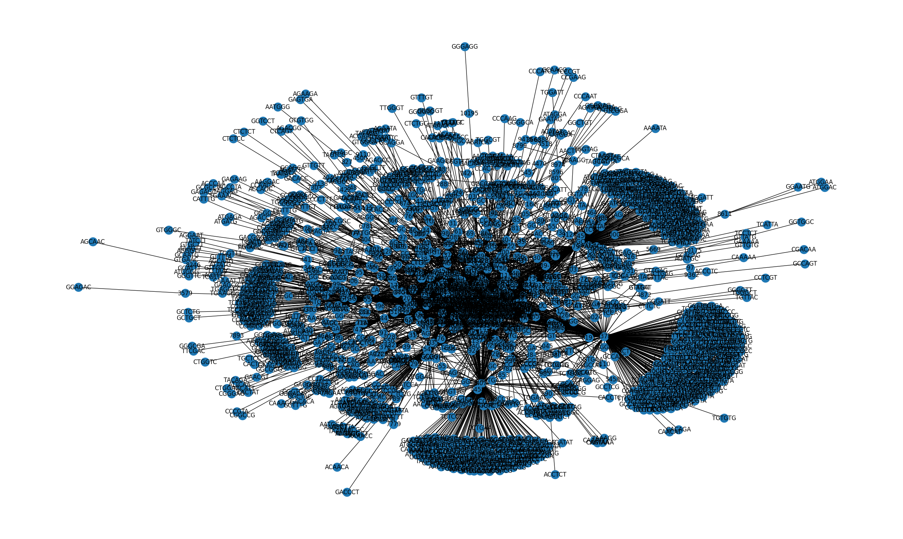
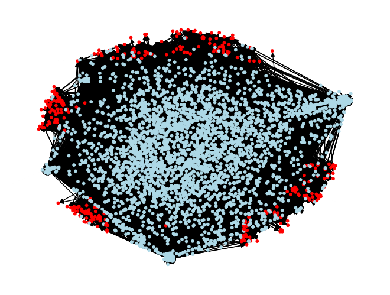

# Hidden-State-Genomics

## Introduction

Advances in Mechanistic Interpretability have made it possible to decompose neural network activations into interpretable features via sparse auto-encoders. These features represent concepts that are learned by the model, and can be used to understand how a neural network makes its predictions. Early mechanistic interpretability studies on protein language models have led to speculation that studying the internals of these models may reveal novel biology, however, investigating this theory poses a difficult technical challenge. We attempt to answer this question by constructing and exploring knowledge-graph relationships between features extracted from genomic language model embeddings and predicted RNA structures for novel cisplatin-RNA complexes. 

### Simple SAE Knowledge Graph

*SAE knowledge graph generated from a random selection of cisplatin binding transcripts. Each node represents a token, feature number, or a sequence descriptor and is connected based on feature activation.*



### Multi-Edge SAE Knowledge Graphs

*Alternate Multi-Layer SAE knowledge graph on a random selection of cisplatin binding motifs (left) and coding cisplatin binding transcripts (right). Red nodes indicate a feature, blue nodes indicate a token, and nodes are connected based on the presence of a token causing feature activation. Edge metadata contains Gene and Intronic/Exonic annotations from NCBI RefSeq reference annotations.*

 

## Notes

The repository is generally organized with input and output `data` from various command line tools in the data folder, and our code under the `hsg` folder. Most of the scripts are intended to be run as command line tools from the root directory (i.e. `python -m hsg.some_folder.some_script --options arguments`). 

Although we mainly rely on open-source datasets for this project, some of the data we used in this analysis -- and many of the models we trained -- are too large for storage in a github repository. In addition, for some elements of our analysis, we rely on other external bioinformatics tools such as MAFFT for large-scale multiple sequence alignment. Documentation on data, processing tools, and data sourcing can be found in the data folder of this repository. If you have further questions, or would like access to the models we trained, feel free to reach out to us using the contact information in `pyproject.toml`.

## Setup Instructions
- Clone the repository

- Download the ClinGen and ClinVar datasets from the google drive shared folder

    - *I placed these inside the data directory, but you can place them anywhere that's convenient for you*

- Install the dependencies in an environment of your choice

    - *The code below executes a pip install in the "editable" mode using the pyproject.toml specifications, and will ensure you have all the dependencies in an environment agnostic way (i.e. python venv vs conda)*

```
pip install -e .
# OR
pip install -e [this repository]
```

- Install a local biocommons.seqrepo database

    - *full documentation here: https://hgvs.readthedocs.io/en/stable/installation.html#installing-seqrepo-optional*

```
seqrepo --root-dir ./data pull
```

- Add a ".env" file in the root directory to specify directories, etc.

    - This file is not tracked by git, but python-dotenv uses it to load environment variables to reduce hardcoding of things like data directories since the files are too large to be tracked as part of the repo.
    - My example is below:

```
# core environment variables
CLIN_GEN_CSV="~/Hidden-State-Genomics/data/erepo.tabbed.txt"
CLIN_VAR_CSV="~/Hidden-State-Genomics/data/variant_summary.txt"
NT_MODEL="InstaDeepAI/nucleotide-transformer-500m-human-ref"
GCLOUD_BUCKET="gs://hidden-state-genomics"
SEQREPO_PATH="./data/2024-12-20"
REFSEQ_CACHE="./data/refseq_cache.txt"
REFSEQ_GTF="data/Annotation Data/hg38.ncbiRefSeq.gtf"
```

- Run unit tests to ensure everything is running smooth

```
python -m unittest [-v]
```

